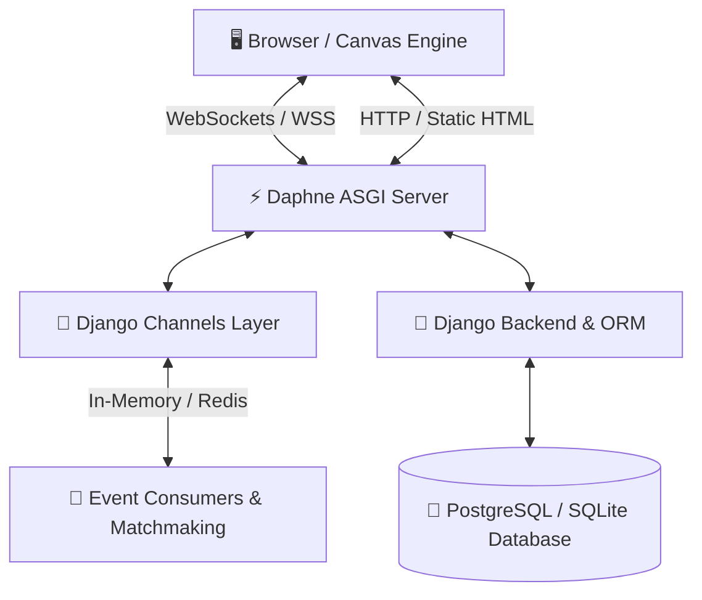

<div align="center">

# 🖊️ PenFight Arena

> **Your Pen. Your Bench. Your Fight.**

A real-time multiplayer & local hotseat physics battle game inspired by classic classroom pen fights.  
Built with **Django**, **Django Channels**, **WebSockets**, and **HTML5 Canvas**.

[](https://www.djangoproject.com/)
[](https://channels.readthedocs.io/)
[](https://www.python.org/)
[](https://www.postgresql.org/)
[](#license)

---

</div>

## 🌟 Overview

**PenFight Arena** brings back nostalgia with a modern competitive twist! Choose your legendary pen, customize it with cosmetics, adjust your flick trajectory, and knock your opponent off the bench. 

The application features a sleek dark UI, custom 2D physics engine running on HTML5 Canvas, instant online matchmaking over WebSockets, friend challenges, progression leveling, cosmetic store, and achievement systems.

---

## 🚀 Key Features

<table>
  <tr>
    <td width="50%">
      <h3>🎮 Battle Modes</h3>
      <ul>
        <li><b>Local Hotseat:</b> Two players battle on a single device with custom physics and arenas.</li>
        <li><b>Private Rooms:</b> Create lobby rooms with custom codes (<code>PF-XXXX</code>) to challenge friends.</li>
        <li><b>Quick Matchmaking:</b> ELO/rating-based real-time queue pairing.</li>
        <li><b>Friend Challenges:</b> Direct battle invites sent seamlessly via player profiles.</li>
      </ul>
    </td>
    <td width="50%">
      <h3>⚙️ Physics & Gameplay</h3>
      <ul>
        <li><b>Interactive Canvas Engine:</b> Real-time vector dragging, tension preview, and angular velocity.</li>
        <li><b>Friction & Collisions:</b> Realistic mass-based momentum, surface friction, and boundary edge detection.</li>
        <li><b>Cosmetics without P2W:</b> Pens have subtle stat variations; skins are purely cosmetic.</li>
      </ul>
    </td>
  </tr>
  <tr>
    <td width="50%">
      <h3>🏆 Progression & Rewards</h3>
      <ul>
        <li><b>XP & Leveling System:</b> Rank up from Novice to Grandmaster as you win matches.</li>
        <li><b>Pen Points (PP) Economy:</b> Earn in-game currency through battles and achievements.</li>
        <li><b>Achievements & Trophies:</b> Complete challenges to unlock exclusive badges and bonus PP.</li>
      </ul>
    </td>
    <td width="50%">
      <h3>🛍️ Store & Social Hub</h3>
      <ul>
        <li><b>Cosmetic Store:</b> Unlock unique pen designs, custom textures, and visual effects.</li>
        <li><b>Friends & Socials:</b> Add friends, inspect player profiles, and track online status.</li>
        <li><b>Leaderboards:</b> Compete on global rankings and track match history.</li>
      </ul>
    </td>
  </tr>
</table>

---

## 🏗️ Architecture & Tech Stack

PenFight Arena uses an asynchronous ASGI pipeline powered by **Daphne** and **Django Channels** to deliver low-latency multiplayer over WebSockets alongside standard HTTP request handling.



### Stack Breakdown

| Layer | Technologies Used |
| :--- | :--- |
| **Backend Framework** | Python, Django |
| **Real-Time Communications** | Django Channels, Daphne, WebSockets |
| **Database** | SQLite *(Local Dev)* / PostgreSQL *(Production)* |
| **Channel Layer** | In-Memory *(Single Server)* / Redis *(Distributed)* |
| **Frontend & Graphics** | Django Templates, HTML5 Canvas 2D Engine, Vanilla JavaScript, CSS3 |

---

## ⚡ Quick Start (Local Setup)

Get PenFight Arena running locally in under **2 minutes**.

### Prerequisites
- **Python 3.10+** installed on your system.

### 1️⃣ Clone the Repository
```bash
git clone https://github.com/CODERYASH2909/Panfight-Arena.git
cd penfight-arena
```

### 2️⃣ Create & Activate Virtual Environment

```bash
# macOS / Linux
python3 -m venv venv
source venv/bin/activate

# Windows (PowerShell)
py -m venv venv
.\venv\Scripts\Activate.ps1
```

### 3️⃣ Install Dependencies
```bash
pip install -r requirements.txt
```

### 4️⃣ Configure Environment
Copy `.env.example` to `.env`:

```bash
# macOS / Linux
cp .env.example .env

# Windows (PowerShell)
Copy-Item .env.example .env
```

Ensure your `.env` is set for local zero-config testing:
```env
USE_SQLITE=True
DEBUG=True
```

### 5️⃣ Database Migration & Game Data Seeding
Initialize database schema and populate default pens, skins, arenas, and achievements:
```bash
python manage.py migrate
python manage.py seed_penfight
```

> 💡 **Note:** `seed_penfight` is idempotent and can be safely executed multiple times.

### 6️⃣ Launch the Development Server
```bash
python manage.py runserver
```

Visit **[http://127.0.0.1:8000/](http://127.0.0.1:8000/)** in your browser to start playing!

---

## 🕹️ How to Play

### 🥊 Local Battle
1. Go to **Play → Local Battle**.
2. Select player names, pens, skins, and arena.
3. Click & drag backward on your pen to set angle and power, then release to flick!
4. Alternate turns until one pen is knocked off the bench.

### 🌐 Online Battle
- **Private Room:** Create a room to get a unique code (e.g., `PF-9482`). Share it with a friend to join!
- **Quick Match:** Join the matchmaking queue to be matched automatically with players of similar rating.
- **Friend Challenge:** Click **Challenge** on any friend's profile to issue a direct battle request.

---

## 📁 Project Structure

```text
penfight-arena/
├── manage.py                 # Django CLI entry point
├── requirements.txt          # Python packages & dependencies
├── .env.example              # Environment variables template
├── penfight/                 # Project configuration, ASGI/WSGI, root URLs
├── accounts/                 # Auth, user profiles, friends, notifications
├── game/                     # Pens, skins, arenas, achievements & local engine
├── multiplayer/              # Rooms, matchmaking, WebSockets & consumers
├── rewards/                  # XP, Pen Points (PP), leveling & reward engine
├── store/                    # Cosmetic shop & inventory management
├── templates/                # Modular HTML5 templates
└── static/                   # CSS, audio, assets, & JS physics engine
```

---

## 🔧 Environment Configuration

| Variable | Description | Recommended (Local) |
| :--- | :--- | :--- |
| `SECRET_KEY` | Django secret key | Any random string |
| `DEBUG` | Enables detailed error logs | `True` |
| `ALLOWED_HOSTS` | Accepted host headers | `127.0.0.1,localhost` |
| `USE_SQLITE` | Switch between SQLite & Postgres | `True` |
| `USE_REDIS_CHANNEL_LAYER` | Redis WebSockets layer | `False` *(Single process)* |
| `REDIS_URL` | Redis server connection URI | `redis://127.0.0.1:6379/0` |

---

## 🛠️ Useful Management Commands

```bash
# Run migrations
python manage.py migrate

# Create new migrations after schema changes
python manage.py makemigrations

# Refresh game data (Pens, Skins, Arenas, Achievements)
python manage.py seed_penfight

# Create Admin Superuser
python manage.py createsuperuser

# Run Django diagnostic check
python manage.py check
```

---

## ❓ Troubleshooting

<details>
<summary><b>Online battle hangs on "Connecting..."</b></summary>
<br>
Ensure you are starting the server using <code>python manage.py runserver</code> so Daphne handles ASGI WebSockets. WSGI-only servers will fail to accept WebSocket connections.
</details>

<details>
<summary><b>New accounts are missing starter pens/skins</b></summary>
<br>
Run <code>python manage.py seed_penfight</code> to populate default inventory items before registering new users.
</details>

<details>
<summary><b>WebSockets across multiple processes fail</b></summary>
<br>
When running multiple worker processes, set <code>USE_REDIS_CHANNEL_LAYER=True</code> in your <code>.env</code> and run a Redis instance.
</details>

---

## 📜 License

Distributed under the **MIT License**. See `LICENSE` for details.

<div align="center">
  <sub>Built with ❤️ using Django & HTML5 Canvas</sub>
</div>

